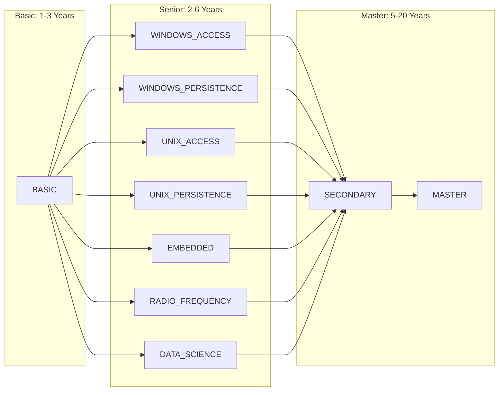

# nicholas.a.barnes22.mil

Welcome to your CCD JQR Repository! This repository is designed to help you demonstrate your technical skills through a series of issues, and allow you and your mentor to monitor your progress across one or more JQRs.

[[_TOC_]]

## What is a CCD?

The CCD workrole (Cyber Capability Developer) consist of programmers that provides offensive and defensive capabilities for the force. There are three levels of certification: **basic**, **senior**, and **master**. Each level has its own associated JQR (Job Qualification Record) which detail tasks and subtasks on what competencies someone needs to display to become certified. These tasks need to be verified by someone already qualified in the work role level. For example, a basic developer can verify basic tasks. Everyone completes the same basic certification but specialize into a specific discipline at the senior level (see below).

## What is a JQR?

The DOD uses JQR's (Job Qualification Records) to track and certify individual's in various workroles. Completing a JQR means to fully account for all Knowledge, Skills, and Abilities required to perform your job. It is the responsibility of the individual to maintain their JQR so they remain current on requirements.

For convienience, all items in your JQR are created in this repository as "issues". Each issue is an individual competency that you must demonstrate mastery of.

## Repository Structure

- **Main Branch**: The default branch with the initial codebase.
- **Issue Branches**: For each issue, you will create a new branch where you'll work on the respective task.

## How to Use This Repository

### 1. Issues

Issues are used to track the completion of JQR tasks. You can view them in the "Issues" tab in gitlab. It is recommended to use your "issue board" accessible at (Plan > issue boards) to make it clear to your mentor which issues you are working on and which ones are ready for their review.

**IMPORTANT NOTE:** Ensure that your mentor is the one who closes issues when it's time to validate a skill. The closer's initials are what populate the "Trainer" section during the JQR document generation.

### 2. Branching

For each issue:
- Create a new branch from `main`.
- Name the branch according to the issue you are working on, e.g., `issue-1-add-authentication`.

### 3. Working on Tasks

- Ensure your solution adheres to the acceptance criteria mentioned in the issue.
- Make regular commits with meaningful messages to demonstrate your progress.

### 4. Merge Requests (MR)

Once you've completed a task:
- Push your branch to Gitlab if you haven't already.
- Open a Merge Request from your issue branch to `main`.
- In the MR description, ensure to:
  - Provide a summary of the changes.
  - include the verbiage "Closes: #xx" where "xx" represents the issue number
  - Mention any challenges encountered and how you overcame them.
  - Tag your mentor for review using `@mentorUsername`.
- Ensure all checks (if any) are passing before requesting a review.

### 5. Reviews

- Your mentor will review your MR and provide feedback.
- Address any feedback and update your MR accordingly.
- Once approved, merge your branch into `main`.

### 6. Using CI/CD

- This repo uses the file `.gitlab-ci.yml` to do actions such as creating JQR documents.  DO NOT EDIT `.gitlab-ci.yml`. However, you can still run CI for your own training purposes by changing the `.gitlab/gitlab-ci/dev/dev_pipeline.yml` file. As long as the file exists, you are free to rewrite it in any way you choose.

## Generating a Filled out JQR

This repository supports automatically generating a filled out JQR based on your closed issues in Word and PDF format via pipelines.

1. Go to `build` > `pipelines`, and click `Run pipeline`.
 
2. Select the appropriate JQR `LEVEL` from the drop-down (Basic / Senior / Master).

3. Select the appropriate JQR `SPECIALIZATION` if applicable from the drop-down.

4. Click on `Run pipeline`.

5. Artifacts can be downloaded from the `jqr:generate:docx` and `jqr:generate:pdf` jobs.

## Troubleshooting

- If something breaks and the pipeline is all of a sudden failing, it's likely that a major update has occured. You can typically repair this behavior by getting a qualified developer to run the "create repo" job in the respective level/speciality you are working on. This WILL NOT erase any of your work, it will only update the pipelines and this README file.
- If the above fix does not work, feel free to [create a new issue](https://code.levelup.cce.af.mil/uscc-work-role-jqs/utils/jqr-generator/-/issues)

## Learning Resources

Reference the [CCD Curriculum repository](https://code.levelup.cce.af.mil/ccds/training/basic/curriculum) for tailored lessons and exercises specific to JQR line items. Ensure to read it's README for instructions on how to view it as a site. 

## Additional Notes

- Feel free to ask for clarification on any issue by commenting on the respective issue. If you feel an issue is worded incorrectly, irrelevant, or otherwise should be changed please see the [USCC Work ROle JQS Wiki](https://code.levelup.cce.af.mil/groups/uscc-work-role-jqs/-/wikis/Processes/CCD-JQR-Update-and-Release-Procedures) for instructions on how to submit your request
