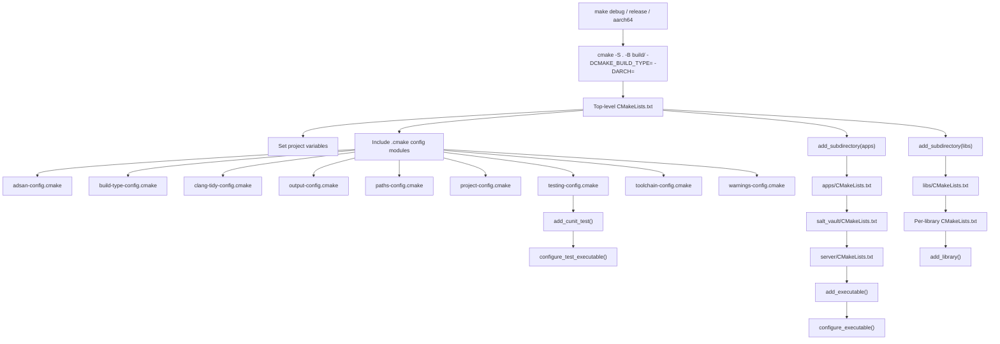

```mermaid
graph TD

%% Makefile & Entry Point
A1[make debug / release / aarch64] --> A2[cmake -S . -B build/<ARCH> -DCMAKE_BUILD_TYPE=<TYPE> -DARCH=<ARCH>]
A2 --> A3[Top-level CMakeLists.txt]

%% Top-level Logic
A3 --> B1[Set project variables]
A3 --> B2[Include .cmake config modules]
A3 --> B3["add_subdirectory(apps)"]
A3 --> B4["add_subdirectory(libs)"]

%% .cmake Modules
B2 --> C1[adsan-config.cmake]
B2 --> C2[build-type-config.cmake]
B2 --> C3[clang-tidy-config.cmake]
B2 --> C4[output-config.cmake]
B2 --> C5[paths-config.cmake]
B2 --> C6[project-config.cmake]
B2 --> C7[testing-config.cmake]
B2 --> C8[toolchain-config.cmake]
B2 --> C9[warnings-config.cmake]

%% Apps Flow
B3 --> D1[apps/CMakeLists.txt]
D1 --> D2[salt_vault/CMakeLists.txt]
D2 --> D3[server/CMakeLists.txt]
D3 --> D4["add_executable()"]
D4 --> D5["configure_executable()"]

%% Libs Flow
B4 --> E1[libs/CMakeLists.txt]
E1 --> E2[Per-library CMakeLists.txt]
E2 --> E3["add_library()"]

%% Testing
F1["add_cunit_test()"] --> F2["configure_test_executable()"]
C7 --> F1
```
